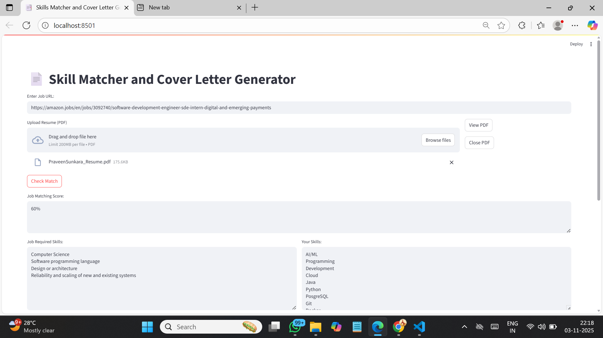
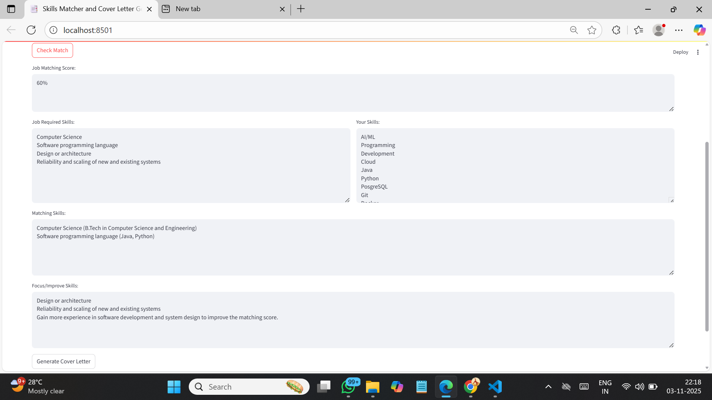
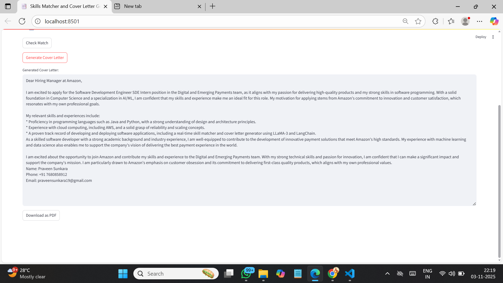

# Skill Matcher and Cover Letter Generator using LLM(### llama-3.3-70b-versatile)
This app matches your resume with a job posting URL and generates a tailored cover letter.

# Images

<p align="center">
  
  
  
</p>


### 🚀 Features
A Streamlit app that:
- Matches job descriptions with your resume
- Displays matching scores and skill gaps
- Generates and downloads personalized cover letters

## Usage

1. Upload your resume PDF
2. Enter job posting URL
3. Check match and generate cover letter

Deployed on Hugging Face Spaces.

## 🛠️ How to run locally

```bash
pip install -r requirements.txt

streamlit run main.py
```
---

Built with ❤️ using Python, Streamlit, and LangChain.
